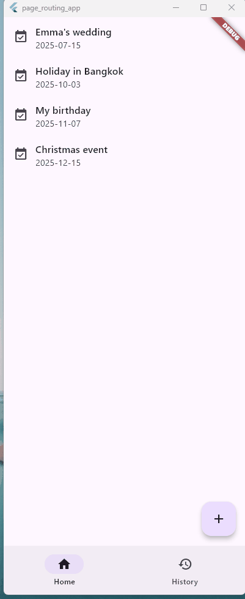

# Flutter: routing demo app using NavigationBar and go_router

This is a little Flutter project that demonstrates a simple routing control using `go_router` package.

## Objective

Most apps consist of multiple pages and it is crucial users are navigated between screens properly.

To learn basics of routing in Flutter, I created a very simple and small app that has just four pages.

For this size of app, we would be able to implement a navigation just using Flutter components such as `NavigationBar` and `Navigator`. But when I think of more complex routing, such as navigating to specific pages in the app from links in notifications, using url-based routing will be more convenient and potentially more scalable.

Thus I implemented a simple routing system using `go_router` package and understood how the url-based navigation with `go_router` works. 

## Pages and components

This app consists of four pages and a bottom navigation bar.

### Pages
 - Home: Top page that is a list of dates.
 - History: Assuming some kind of another list page. 
 - Add: Assuming some kind of a form to add a new list item.
 - Detail: Assuming some information page that corresponds to each list item.

### Navigation UI

How each page can be reached:
 - Top page (Home): by *Bottom navigation bar*
 - History page (History): by *Bottom navigation bar*
 - New item form page (+): by *Floating Action Button* in Top page
 - Detail page: by *pressing* each list item

## go_router

The latest documentation for `go_router`, go to [go_router](https://pub.dev/packages/go_router).

## Platform

In develpment, I selected *Windows app* as my target device.

## Reference

A few resources to get you started if this is your first Flutter project:

- [Lab: Write your first Flutter app](https://docs.flutter.dev/get-started/codelab)
- [Cookbook: Useful Flutter samples](https://docs.flutter.dev/cookbook)

For help getting started with Flutter development, view the
[online documentation](https://docs.flutter.dev/), which offers tutorials,
samples, guidance on mobile development, and a full API reference.
